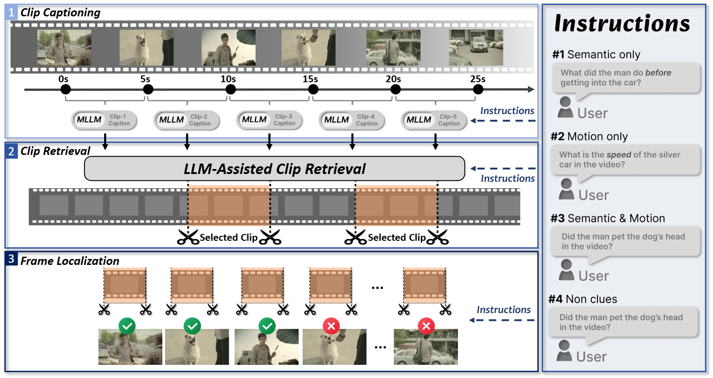
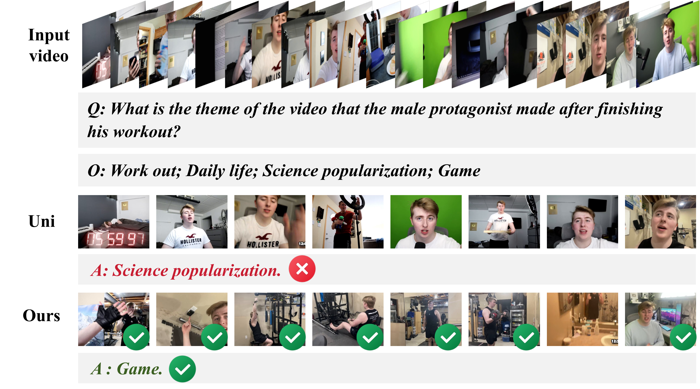
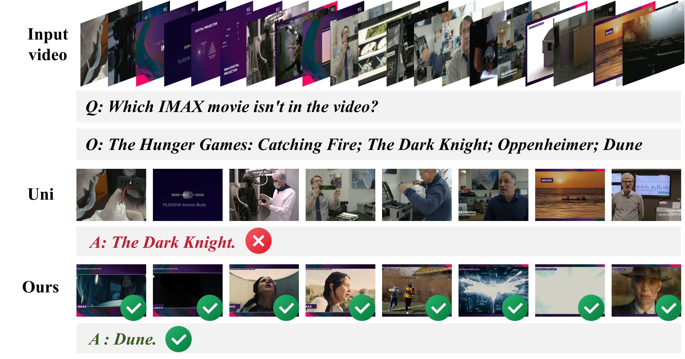

# Aim-MVITG

Aim-MVITG is a research codebase for instruction-conditioned temporal grounding in videos. Given a video and a natural-language question, its frame selector ranks sampled frames by their relevance to that question. A video-language model can then answer using a smaller, task-focused set of frames.

## Research question and answer

**Question:** When a video-language model can inspect only a fixed number of frames, does selecting frames according to the question help it answer video questions more accurately than uniform sampling?

**Answer:** The benchmark comparison included in this repository indicates that it does. With a 32-frame budget, instruction-guided selection scores higher than uniform sampling in every model-and-benchmark pair shown below. The average gains range from 4.5 to 6.6 points. These are the repository's recorded comparison values; the checked-in JSONL files contain frame rankings and scores, not the answer-level benchmark metrics needed to recompute this table.

## How it works

1. A video is sampled into candidate frames and paired with the user's question.
2. The selector predicts a relevance score for each candidate frame.
3. Frames are ranked by score. The highest-scoring `K` frames are selected and placed back in chronological order.
4. A downstream video-language model receives those frames and the question to produce an answer.

During training, `train_itg.py` reads videos, question text, and positive frame positions (`clip_num`) from a JSON dataset. The model learns a per-frame relevance head using binary grounding labels. Evaluation uses the registered `videoitg` model in `lmms_eval/models/videoitg.py` to write frame indices and scores to JSONL.

The supplied inference example scores up to 512 frames and selects 32 by default. The evaluation scripts use a configurable sampling rate and frame budget; those settings are not fixed across all workflows.

## Workflow figures

The overview and example images below are included in `assets/`.

<p align="center">
  
</p>

<p align="center">
  
</p>

<p align="center">
  
</p>

## Benchmark comparison

The table compares uniform sampling (`UNI-32`) with instruction-guided selection (`ITG-32`) at the same 32-frame budget. Values and deltas are retained from the benchmark comparison provided with this repository; they have not been regenerated from the checked-in frame-score files.

| Video model | Frame selection | LongVideoBench | MLVU | VideoMME-S | VideoMME-M | VideoMME-L | CG-Bench-mini | Average |
|---|---|---:|---:|---:|---:|---:|---:|---:|
| InternVL2.5-8B | UNI-32 | 58.3 | 66.4 | 75.1 | 61.7 | 53.1 | 37.7 | 58.7 |
| InternVL2.5-8B | ITG-32 | 61.9 (+3.6) | 75.0 (+8.6) | 78.0 (+2.9) | 67.1 (+5.4) | 56.9 (+3.8) | 46.7 (+9.0) | 64.3 (+5.6) |
| InternVL2.5-26B | UNI-32 | 55.6 | 71.3 | 78.1 | 67.1 | 56.9 | 40.6 | 61.6 |
| InternVL2.5-26B | ITG-32 | 63.0 (+7.4) | 78.9 (+7.6) | 80.8 (+2.7) | 69.0 (+1.9) | 59.9 (+3.0) | 48.7 (+8.1) | 66.7 (+5.1) |
| InternVL3.5-8B | UNI-32 | 60.0 | 70.0 | 77.0 | 62.4 | 53.4 | 40.9 | 60.6 |
| InternVL3.5-8B | ITG-32 | 65.7 (+5.7) | 74.1 (+4.1) | 78.4 (+1.4) | 65.9 (+3.5) | 59.0 (+5.6) | 47.6 (+6.7) | 65.1 (+4.5) |
| Qwen3-VL | UNI-32 | 59.1 | 64.1 | 76.0 | 60.9 | 55.1 | 40.1 | 59.2 |
| Qwen3-VL | ITG-32 | 63.6 (+4.5) | 77.2 (+13.1) | 79.9 (+3.9) | 66.6 (+5.7) | 60.3 (+5.2) | 47.3 (+7.2) | 65.8 (+6.6) |
| LLaVA-Video-7B | UNI-32 | 58.7 | 66.8 | 76.3 | 60.3 | 52.7 | 35.8 | 58.4 |
| LLaVA-Video-7B | ITG-32 | 61.6 (+2.9) | 74.6 (+7.8) | 77.3 (+1.0) | 65.9 (+5.6) | 55.2 (+2.5) | 42.8 (+7.0) | 62.9 (+4.5) |
| Eagle2.5-8B | UNI-32 | 63.0 | 67.8 | 78.8 | 64.1 | 55.9 | 41.2 | 61.8 |
| Eagle2.5-8B | ITG-32 | 66.8 (+3.8) | 76.5 (+8.7) | 80.0 (+1.2) | 67.8 (+3.7) | 60.3 (+4.4) | 49.0 (+7.8) | 66.7 (+4.9) |

## Repository contents

- `infer.py`: single-video example that selects frames and saves them as JPEGs.
- `train_itg.py`, `train_itg_mem.py`: grounding-model training entry points.
- `eagle/`: multimodal model implementation and training support.
- `lmms_eval/`: evaluation harness, benchmark tasks, and model adapters.
- `scripts/videoitg/`: distributed training launch scripts.
- `scripts/eval_lmms_eval/`: grounding and downstream evaluation scripts.
- `results/`: example per-video frame-ranking JSONL files.
- `assets/`: workflow figures and the sample video used by `infer.py`.

## Setup

The provided scripts target Linux with an NVIDIA GPU and CUDA. `requirements.txt` pins PyTorch 2.6.0 and torchvision 0.21.0 for CUDA 12.4. Windows and CPU-only execution are not covered by the supplied scripts.

```bash
git clone https://github.com/hassaan4717/Aim-MVITG.git
cd Aim-MVITG

conda create -n aim-mvitg python=3.12 -y
conda activate aim-mvitg
python -m pip install --upgrade pip
pip install -r requirements.txt
```

The model checkpoint is downloaded from Hugging Face when requested by the inference/evaluation code. The default inference checkpoint is `nvidia/VideoITG-8B`; ensure you have sufficient GPU memory and have accepted any applicable model-host terms before downloading it.

## Run inference

`infer.py` is a small example, not a command-line application. It uses `assets/imax.mp4`, a sample question, the `nvidia/VideoITG-8B` checkpoint, and a 32-frame selection by default. Edit the values in `main()` to use another video, question, or frame budget, then run:

```bash
python infer.py
```

The script prints the selected source-frame indices and writes selected frames to `./vis/`. It currently targets `cuda:0` and loads the model in half precision.

## Evaluate

The grounding stage is launched through the included LMMs-Eval wrapper. The example script uses eight processes; adjust it for the GPUs available on your machine.

```bash
bash scripts/eval_lmms_eval/videomme_grounding.sh
```

By default, this writes `./videomme_result_512/results.jsonl`. Set `pretrained`, `target_fps`, `num_frames`, and `output_dir` in the script as needed. The file contains one record per benchmark item, with fields such as `doc_id`, `index` (frame indices ranked by relevance), `logits` (the corresponding scores), `contexts`, and `video_path`.

To evaluate a downstream model, set its `frame_indices_jsonl` argument to the grounding output and choose a frame budget such as 32. For example, edit the path in `scripts/eval_lmms_eval/internvl2.5.sh`, then run:

```bash
bash scripts/eval_lmms_eval/internvl2.5.sh
```

Adapters for InternVL 2.5, InternVL 3.5, Qwen3-VL, and Eagle2.5 are provided. They use the first `K` ranked frame indices and sort those selected indices into chronological order. Keep the grounding and downstream benchmark split/doc IDs aligned. The scripts under `scripts/eval_lmms_eval/` launch distributed evaluation and may require edits for the local model paths, GPU count, and dataset setup.

### Result files

The checked-in files under `results/` are selector outputs for VideoMME, MLVU, MLVU-dev, LongVideoBench, and CG-Bench. Each line is JSONL; a shortened example is:

```json
{"doc_id": 12, "index": [120, 60, 180], "logits": [0.98, 0.97, 0.95]}
```

`index` and `logits` are ordered by descending selector score in these grounding outputs. The downstream adapters take the requested top frames and restore chronological order. These files do not contain the downstream models' generated answers or aggregate accuracy. Some records also contain video paths from the machine that produced them; those paths will not resolve on another system.

The grounding adapter appends to `results.jsonl` in its output directory. Use a fresh output directory (or move the previous output file) before rerunning an evaluation to avoid mixing records from separate runs.

## Training

Training requires data and compute beyond what is included in this repository. The grounding script expects a dataset at `./data/video_itg_data.json`, videos under `./data/`, and a compatible Qwen2 checkpoint. The dataset and checkpoint are not bundled here. Each data record supplies a video path, question text, and `clip_num` frame positions used as positive grounding labels.

The provided training launcher assumes a SLURM environment and distributed GPU execution. It also requires DeepSpeed and FlashAttention in addition to the base requirements. Review the launcher paths, checkpoint, GPU/process settings, and dataset configuration before using it:

```bash
pip install deepspeed flash-attn==2.4.2 --no-build-isolation
bash scripts/videoitg/finetune-qwen2-7b-grounding.sh <run-name>
```

The script uses SLURM environment variables and launches eight processes per node, so it is not a general single-GPU training command. Adapt the launcher to your cluster and available hardware.

## License

The repository code is provided under the Apache License 2.0; see [LICENSE](LICENSE). The model weights are subject to the NVIDIA License in [LICENSE_Model](LICENSE_Model), which limits use to non-commercial research or evaluation. Third-party components, datasets, and model checkpoints may carry additional terms; review their licenses before use.
